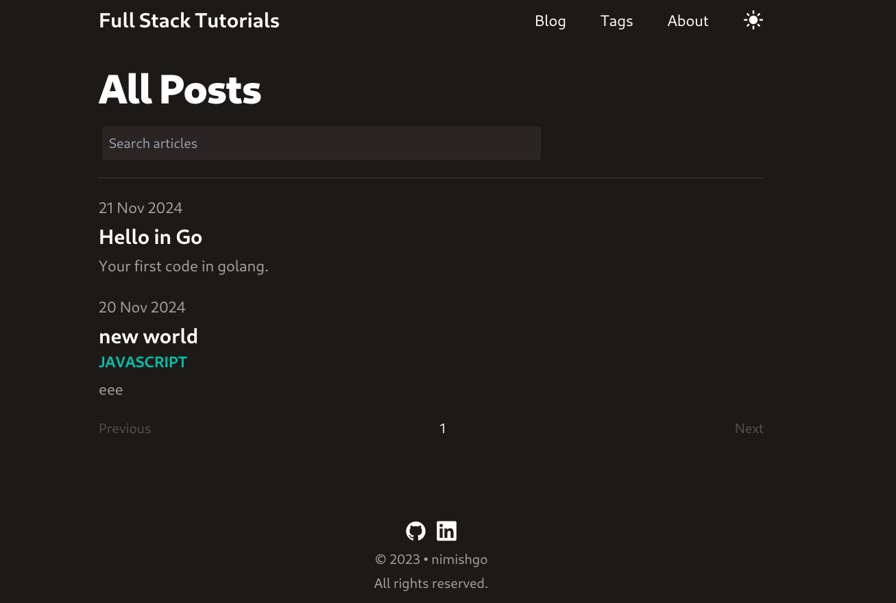
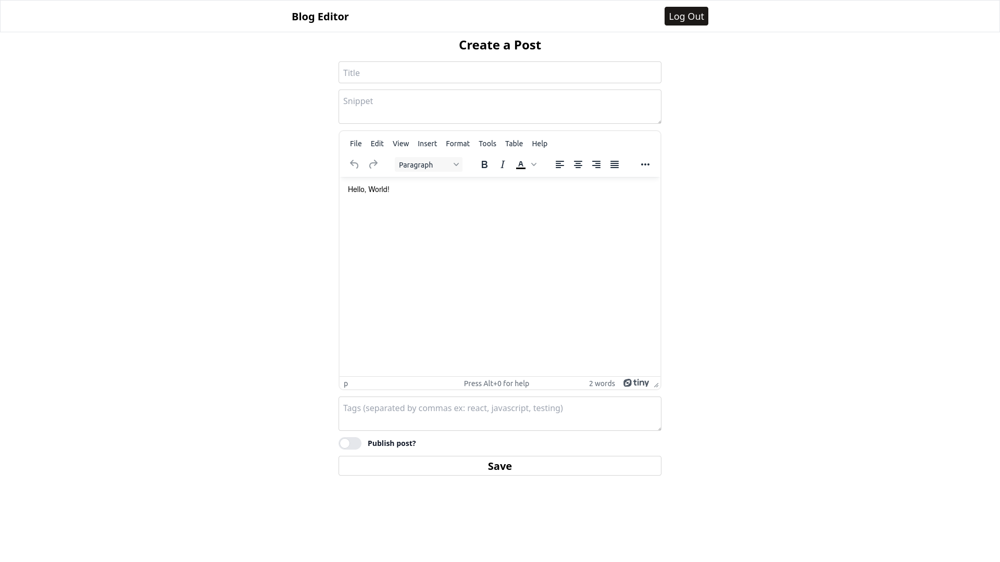

# My blog app

MERN stack (MongoDB, Express, React, NodeJs) with Tailwind CSS with Dual clients: Blog (for visitors, with messaging) and Editor (owner-exclusive,
post management, comment moderation).

### links 
blog : https://my-blog-nimish.netlify.app/ 

editor : https://client-blog-editor.netlify.app/login

Blog Client : 

Editor : 

